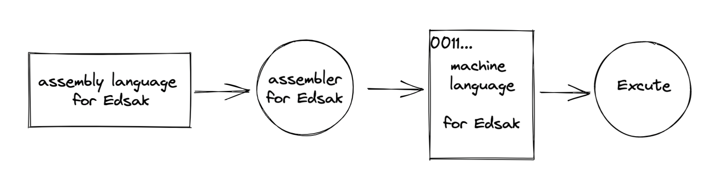

# 1장. 사랑을 사랑한 기술

이번 장에서는 무엇을 배우는가?

- 신기술은 이전 기술을 거름 삼아 새로운 철학과 기법을 더해 타나내는 것이다. 1장에서는 간단하게 이전 기술들의 특징들을 살펴보고 간다.

## 기계어에서 객체 지향 프로그래밍 언어로

1. 기계어 등장

   - 기계어는 기계가 이해하는 유일한 언어로, 2진 숫자인 0과 1로만 표현된다.
   - 기계어 코드는 CPU에 따라 달라 전용 기계어가 필요하다.

2. 어셈블리어

   > *"기계어의 명령들을 일상 용어로 표현하고 이걸 기계가 알 수 있는 기계어로 번역하게 하면 어떨까?"*

   - 기계어 명령어와 일상 용어를 일대일로 매칭하는 코드표를 만들었고, 그 코드표를 **어셈블리**라고 불렀다.
   - CPU마다 실행할 수 있는 기계어 세트가 달랐으니 당연히 어셈블리어도 기계어에 따라 달랐다.
   - 어셈블리어를 기계어로 번역해주는 소프트웨어를 어셈블러라고 한다.

   

3. C 언어

   > "어셈블리어는 기계에 맞는 전용 어셈블리어를 사용해야해. 너무 불편해!"

   - 소스 파일을 단 하나만 만들어 각 기계에 맞는 컴파일러 컴파일만 하면 각 기계에 맞는 기계어 목적 파일을 만듬.
   - 하나의 소스를 가지고 기종별로 컴파일만 하면 해당 기종별로 목적 파일, 즉 기계어 코드가 만들어 진다.

4. C++

   - C언어에 객체 지향 개념을 도입하면서 역사에 한 획을 그은 언어.

5. JAVA

   > C언어는 운영체제가 하드웨어의 특성을 추상화하고 컴파일러는 운영체제별로 만들어져 공급하게 되는데, 그 운영체제들이 또 나름의 특성이 있었기에 하나의 소스로 각 기종별로 컴파일하기 전에 그 기종에 맞게 소스를 변경하는 작업이 필요해..
   > C++언어는 순수 객체 지향이 아니야. 객체 없는 프로그래밍도 가능하거든.

   - 자바는 클래스를 떠나 존재할 수 있는 것은 아무 것도 없다. 객체 지향 언어의 중심에는 클래스가 있다.

   - 가상 머신을 도입하면서 컴파일러를 기종별로 따로 두지 않아도 된다.

     

## 저자의 생각

### CBD? SOA? OOP? Spring Framework?

CBD(Component Based Development), SOA(Service Oriented Architecture) 이 것 들은 제품이 아니며 하나의 사상이다.

객체 지향 방법론은 이른부터 방법론이며, 자바는 객체 지향 방법론의 사상 및 개념이 숨어들어 있다. 또한 객체 지향은 긴 세월 속에 정제되어 거의 모든이가 동의하는 객체 지향 4대 특성, 객체 지향 설계 5원칙, 디자인 패턴 등의 개념이 정립됐다. 

Spring은 사상이면서 또 단일 제품이다. 객체 지향, 디자인 패턴을 관통해 일가를 일궈낸 스프링은 객체 지향의 기반 위에 굳건히 서 있다. 스프링 프레임워크는 OOP 프레임 워크이다.

스프링 프레임워크는 규모의 방대함에도 불구하고 자기 철학을 통해 일관성 있는 방식으로 그 방대함을 쌓아 올렸다. 스프링 삼각형은 POJO(Plain Old Java Object)에 `IoC/DI`, `AOP`, `PSA` 세 가지 유형의 진동을 줌으로써 거대한 프레임워크를 완성해 냈다. 도한 스프링 프레임워크는 ORM, AOP, CoC 등 엔터프라이즈 애플리케이션을 구현하는 데 필요한 거의 모든 서비스를 지원해준다.

그래서 CBD, SOA 등 거대 IT 기업의 홍보성 말장난에 휘둘리지 말고 그 본질을 잘 살펴서 취할 것은 취하고 버릴 것은 버리는 ,즉 선별해내는 능력을 통해 개발자로서 성장하자.

## 정리

저자의 말 중 최근에 너도나도 MSA 도입 얘기가 많이 나왔다. 나 또한 회사에서 최신기술에 열광 받아 MSA를 도입해야한다고 말을 했었는데 이 책을 읽고나니 본질 부터 파악하지 못 하고 그저 사상을 쫓았던 것 같다. 

객체 지향을 이해해야 **올바른** 자바 프로그램을 만들 수 있고, 또 스프링에 입문할 수 있는 것 같다.