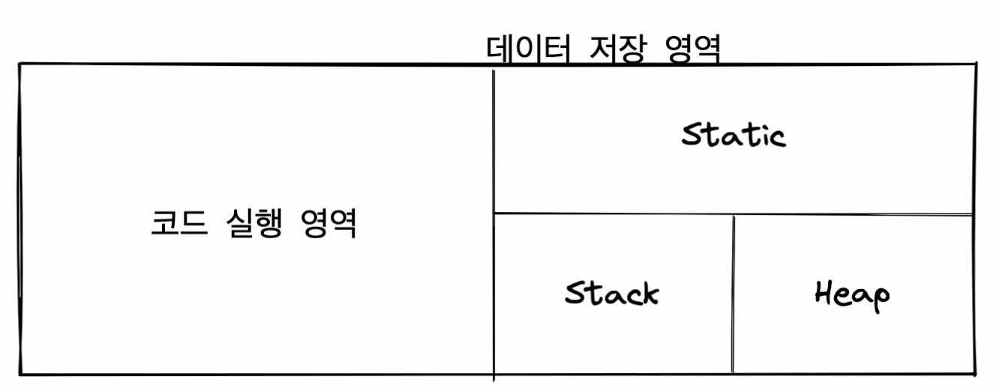

# 2장

날짜: 2021년 10월 29일

이번장에서는 자바의 변수가 메모리에 어떻게 저장되고 사용되는지, 메모리가 어떻게 호출되고 메모리에 어떤 변화를 일으키는지 살펴보면서 객체 지향프로그래밍과 스프링으로 나아가기 위한 사전 지식을 점검한다.

## 자바 프로그램의 개발과 구동

JVM이란

- 현실 세계에서 컴퓨터를 구동하기 위해서는 물리적 컴퓨터인 하드웨어와 운영체제, 그리고 그 위에서 구동될 소프트웨어가 필요하다.
- 자바의 가상세계는 이러한 현실세계를 그대로 모방한다.

JDK란,

- 개발자가 개발 도구를 이용해 개발하고 운영체제를 통해 물리적 컴퓨터인 하드웨어 상에서 구동한다.
- 그 개발 도구가 JDK.

JRE란,

- 자바 실행 환경

자바 개발 도구인 JDK를 이용해 개발된 프로그램은 JRE에 의해 가상의 컴퓨터인 JVM 상에서 구동된다.

프로그램이 메모리를 사용하는 방식을 살펴보자.

- static 영역
  - 클래슬의 놀이터
- Stack 영역
  - 메서드들의 놀이터
- Heap 영역
  - 객체들의 놀이터

Main을 실행하면?

1. JRE는 먼저 프로그램 안에 main() method가 있는지 확인한다.
2. main()을 확인하고 JRE는 프로그램 실행을 위한 사전 준비에 착수
3. JVM를 실행시켜 목적파일을 받아 그 목적 파일을 실행한다. (전처리)
4. JVM은 가장 먼저 java.lang 패키지를 T 메모리의 스태틱 영역에 가져다 놓는다.
5. JVM은 개발자가 작성한 모든 클래스와 임포트 패키지 역시 스태틱 영역에 가져다 놓는다.

## 변수와 메모리

변수는 메서드 스택 프레임 안에 할당된다.

## 블록 구문과 메모리

여는 중괄호를 만나면 스택 프레임이 시작된다.

스택 프레임은 메서드의 스택 프레임이 아니라, if문 그것도 참인 블록의 스택 프레임이다.

## 지역 변수와 메모리

변수는 어디에 저장되는가?

1. 지역 변수
   1. 스택 영역
2. 클레스 멤버 변수
   1. 스태틱 영역
3. 객체 멤버 변수
   1. 힙 영역

## 메서드 호출과 메모리

메서드 호출이 일어나면 무조건 호출되는 메서드의 스택 프레임이 T 메모리 스택 영역에 새로 생성 된다.

## 전역 변수와 메모리

클래스 멤버 변수를 사용하면 전역 변수 처럼 사용할 수 있다.

하지만 사용하지말라 . 왜?

- 프로젝트 규모가 커지면서 메서드에서 전역 변수의 값을 변경하기 시작하면 전역 변수에 저장돼 있는 값을 파악하기가 쉽지 않다.

대신에, 읽기 전용으로 값을 공유해서 전역 상수를 쓰는 것을 추천.

## 멀티 스레드 / 멀티 프로세스의 이해

멀티 스레드

- 멀티 스레드의 T 메모리 모델은 스택 영역을 스레드 개수만큼 분할해서 쓰는 것.
- 하나의 T 메모리만 사용하는데 스택 영역만 분할해서 사용하는 구조.
- 스태틱 영역과, 힙 영역은 공유해서 사용하기 때문에 메모리 사용량은 멀티스레드보다 적다.
- 그치만 프로세스보다 제어하기가 어렵다.

멀티 프로세스

- 멀티 프로세스는 다수의 데이터 저장 영역, 다수의 T 메모리를 갖는 구조
- 각자의 T 메모리가 있고 각자의 고유 공간이므로 서로 참조할 수 없다.
- 스레드 보다 안전하지만,
- 메모리 사용량은 그만큼 크다.
