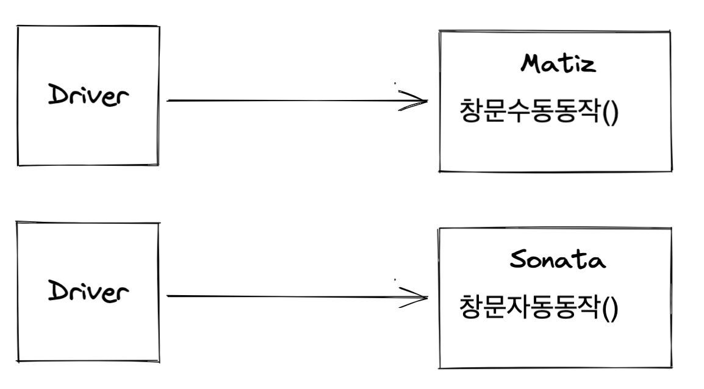

# 05. 객체 지향 설계 5원칙 - SOLID

날짜: 2021년 10월 26일

이번 장에서는 앞장에서 소개된 객체 지향의 4대 특성으 가지고 객체 지향의 특성을 올바르게 사용하는 방법(객체 지향 언어를 이용해 객체 지향 프로그램을 올바르게 설계)인 객체 지향 설계의 정수인 5원칙 SOLID 를 배운다.

## 결합도와 응집도

결합도란,

- 모듈(클래스)간의 상호 의존 정도를 나타냄.
- 결합도가 낮으면 모듈간의 상호 의존성이 줄어들어 객체의 재사용성이나 수정, 유지보수가 용이

응집도란,

- 모듈 내부에 존재하는 구성 요소들의 기능적 관련성을 나타냄.
- 응집도가 높은 모듈은 하나의 책임에 집중하고 독립성이 높아져 재사용이나 기능의 수정, 유지보수가 용이

## SOLID를 왜 해야하는가?

그렇지 못한 소프트웨어 비해 상대적으로 이해하기 쉽고 리팩터링과 유지보수가 수월할 뿐만 아니라 논리적으로 정연하다.

```java
class Util {
		public void rollDie() {
		}

		public int randomNumber() {
		}

		public boolean checkIsOddNumber() {
		}
}

```

```java
class Die {
		public void rollDie() {
		}
}

class Lotto {
		public int randomNumber() {
		}
}

class Day {
		public boolean checkIsOddNumber() {
		}
}
```

<br/>

# SRP - 단일 책임 원칙

> "어떤 클래스를 변경해야 하는 이유는 오직 하나뿐이어야 한다." - 로버트 C.마틴

## 등장 배경

책임이 몰려있는 클래스는 냄새나는 코드(유지보수성 최악, 논리적 최악)이므로, **역할(책임)을 분리하자는 원칙**이 단일 책임 원칙이다.

```java
class Stock {
	void storeData() { }
  void extractDate() { }
  void buy() { }
}
// Stock 클래스는 주식을 사야하는것과, 추출하는것과, 데이터를 저장하는 모든 책임을 지고 있다. ㅠㅠ
// 이러한 접근법을 이어간다면 이 클래스는 점점 커지고 God Object 라는 안티-패턴에 직면할 수도 있다!!
```

이렇게 SRP를 위배하는 코드는

- 여기저기 if문을 사용하여 매끄럽지 못함 (책 예시)
- 유지보수가 힘들어진다.

- 리팩토링

  ```java
  class StockData {
  	void storeData() { }
  }

  class StockExtractor {
    void extractDate() { }

  class StockBuyer {
    void buy() { }
  }
  // 여러 책임들을 작은 클래스들로 나누어 유지보수와 확장에 용이성을 갖춰질 수 있다.
  ```

## 단일 책임?

> "하나의 모듈은 하나의, 오직 하나의 액터에 대해서만 책임져야 한다." - 로버트 C.마틴

**액터란 시스템이 동일한 방식으로 변경되기를 원하는 사용자(클라이언트) 집단**을 말한다. 즉 **액터**란 하나의 사용자가 될 수 도 있고 여러 사용자가 모여서 하나의 액터가 될 수도 있다.

그러므로 SRP를 생각할 때는 설계하는 해당 클래스에만 초점을 맞추는 것이 아니라 거시적인 관점에서 해당 클래스에 어떤 '액터'들이 의존하게 되는지를 생각해봐야 올바르게 준수 할 수 있다.

**예를 들어**

- '스마트폰'이라는 객체를 철수와 영희가 모두 사용하고 있다고 가정.
- 철수는 스마트폰을 영상시청, 영희는 전화 통화를 위해 사용

```java
class SmartPhone implements VideoPlayer, Calling { ... }
```

- 스마트폰은 철수와 영희가 다른 방식으로 변경되기를 원할 수 있기 때문에, **철수와 영희는 별개의 액터**. (철수가 동영상 시청을 위해 액정크기 변경한다면 영희의 전화통화 요구사항에는 맞지 않는 변경사항이 된다.)
- 그러므로 해당 스마트폰이 SRP를 준수하기 위해서는 다른 액터에 맞게 분리되어야 한다.

<br/>

# OCP - 개방 폐쇄 원칙

> "소프트웨어 엔티티(클래스, 모듈, 함수 등)는 확장에 대해서는 열려 있어야 하지만 변경에 대해서는 닫혀 있어야 한다." - 로버트 C.마틴

## 등장배경



`운전자`가 `마티즈` 차에서는 창문을 **수동 동작**을하고 `소나타` 차에서는 창문 **자동 동작**을 해야하는데 차량의 변경에 따라 영향을 너무 많이 받게된다.


상위 클래스 또는 인터페이스를 중간에 둠으로써 다양한 자동차들의 변경사항에 대해 영향을 받지 않게 되고,

- 자동차 입장에서는 자신의 확장에는 개방되어 있고,
- 운전자 입장에서는 주변의 변화에 폐쇄되어 있는 것이다.

## 특징

개방 폐쇄 원칙을 지킨다면?

- 유연성, 재사용성, 유지보수성 등을 얻을 수 있어 유지보수에 용이하다.
- herry 세션에서 Repository Interface를 두어 다양한 Repository 클래스들을 구현하여 의존성 주입하여 변경에는 개방되어있고, Repository 를 사용하는 Service는 주변의 변화에 폐쇄됨을 알 수 있다.

<br/>

# LSP - 리스코프 치환 원칙

> "서브 타입은 언제나 자신의 기반 타입(base type)으로 교체할 수 있어야 한다." - 로버트 C.마틴

## 등장 배경

객체 지향에서의 **상속은 조직도나 계층도가 아닌 분류도가 되어야 한다**고 했다.

```java
// 계층도로 클래스를 분류한 나쁜 코드
class 딸 extends 아버지 { ... }

아버지 춘향이 = new 딸(); // ???

// 분류도 형태로 상속을 구현항 좋은 코드
class 팽귄 extends 동물 { ... }

동물 뽀로로 = new 팽귄(); // 오...
```

## 특징

> "하위 클래스의 인스턴스는 상위형 객체 참조 변수에 대입해 상위 클래스의 인스턴스 역할을 하는 데 문제가 없어야 한다."

리스코프 치환 원칙은 객체 지향의 상속이라는 특성을 오바르게 활용하면 자연스럽게 얻게 됨.

동성님의 정사각형 직사각형과 LSP에 대해 정리한 글에서

- 클래스의 분류의 잘못으로 상위 타입(직사각형)에서 정한 명세를 하위 클래스(정사각형)에서도 지키지 못하여 LSP를 위반
- 참고 : [instanceof-연산자](https://github.com/sds1vrk/Be-Victory-Team-Book-Study/blob/main/4.%20README.md#instanceof-%EC%97%B0%EC%82%B0%EC%9E%90)

<br/>

# ISP - 인터페이스 분리 원칙

> "클라이언트는 자신이 사용하지 않는 메서드에 의존 관계를 맺으면 안된다." - 로버트 C. 마틴

## 등장배경


`User1`은 `op1()` , `User2`은 `op2()` , `User3`은 `op3()` 만 사용한다고 가정했을 때,

- `User1`은 `op2()`, op3() 를 사용하지 않음에도 이것들에 의존하며, 사용하지도 않는 op2() 변경에 따라 user1은 op2()에 의존하게 됨


클라이언트가 각자 사용할 메서드(최소한의 메서드)에 따라 분리된 인터페이스에 의존하여 의존성을 약화시켜 손쉬운 리팩토링, 높은 재사용성을 갖는 코드를 가질 수 있다.

- 그래서 상위 클래스는 풍성할수록 좋고, 인터페이스는 작을수록 좋다.

## SRP vs ISP

SRP와 ISP는 같은 문제에 대한 두 가지 다른 해결책이라고 볼 수 있다. 특별한 경우가 아니라면 단일 책임 원칙을 적용하는 것이 더 좋은 해결책이라고 할 수 있다.

SRP를 유지하지만 ISP를 깨뜨릴 수 있는 코드의 예로 Facade 패턴이 있다. "더 큰 하위 시스템에 대한 단순화된 액세스를 제공"하는 단일 책임이 있지만 기본 하위 시스템이 크게 다른 생각을 노출해야 하는 경우 ISP를 위배한다.

로버트 마틴은 2018년 5월 16일에 다음과 같이 트윗했다.

> ISP는 인터페이스에 대한 SRP와 유사하다고 볼 수 있습니다. 하지만 그 이상입니다. 
> ISP는 다음과 같이 일반화합니다. "필요 이상으로 의존하지 마십시오." 
> SRP는 "같은 이유로 같은 시간에 변화하는 것들을 모아라"로 일반화합니다.
>
> 푸시와 팝이 모두 있는 [스택 클래스](https://newbedev.com/python-stack-class-in-python-pop-code-example) 를 상상해 보십시오 . 푸시만 하는 클라이언트를 상상해 보십시오. 해당 클라이언트가 스택 인터페이스에 의존할 경우 필요하지 않은 pop에 의존합니다. SRP는 푸시와 팝을 분리하지 않지만 ISP는 분리합니다.

<br/>

# DIP - 의존 역전 원칙

> "높은 수준의 모듈은 낮은 수준의 모듈에 의존하지 않아야 한다. 두 모듈 모두 추상화에 의존해야 한다."
> "추상화는 세부 사항에 의존하지 않아야 한다. 세부 사항은 추상화에 의존해야 한다."

## 예시

만일 우리가 MySQL 데이터베이스 사용하는 자바 어플리케이션을 만든다고 해보자.


그래서 (높은 수준) `Java Application`에서 (낮은 수준)`MySQL ODBC Driver` class를 이용해 작업하고 있다.

```java
// Java Applicationpublic class Main {
    public static void main(String[] args) {
        MySQLODBCDriver driver = new MySQLODBCDriver();
        driver.query("select * from TIL;");
    }
}
```

### 문제 발생

🚨 그런데 MySQL이 💵**유료화 선언**을 해버리면서 다른 ODBC Driver도 바꿔야하며 Java Application 에서 코드도 하나하나 바꿔야 한다. 너무 귀찮고 유지보수가 어려우며 버그가 터질지도 모른다!! 😩


```java
// Java Applicationpublic class Main {
    public static void main(String[] args) {
// MySQLODBCDriver driver = new MySQLODBCDriver();// driver.query("select * from TIL;");

        MariaODBCDriver driver = new MariaODBCDriver();
        dirver.execute("select * from TIL");// 심지어 이 Driver의 메서드는 이전과 비슷하지도 않다! ㅠㅠ
    }
}
```

### 해결 방안

이렇게 변하기 쉬운 ODBC Driver에 의존하는 Java Application은 쉽게 부서질 수 있는 나쁜 냄새(안좋은 구조)를 풍기고 있다.

이를 개선하기 위해, Java Applicatio이 변하기 쉬운 구체적인 ODBC Driver이 아닌 추상화된 ODBC Driver에 의존하게 하자.


이렇게 되면 다른 ODBC Driver로 변경돼도 Java Appication은 이제 그 영향을 받지 않는 형태로 구성된다.

- 기존에는 MySQL ODBC Driver가 어디에도 의존하지 않는 클래스 였지만, 추상적인 JDBC Interface 에 의존하게 됐다. ⇒ **의존 방향이 역전 됨!**
- 그리고 자바어플리케이션은 자신보다 변하기 쉬운 JDBC Driver에 의존하던 관계를 중간에 추상화된 JDBC Interface 를 추가해 두고 의존 관계를 역전시키고 있음.

이 처럼, 자신보다 변하기 쉬운 것에 의존하던 것을 추상화된 인터페이스나 상위 클래스를 두어 변하기 쉬운 것의 변화에 영향받지 않게 하는 것이 **`의존 역전 원칙`** 이다.

---

## 참고

- [https://siyoon210.tistory.com/155](https://siyoon210.tistory.com/155)
- [https://medium.com/@carlos.ariel.mamani/the-god-object-or-god-class-anti-pattern-bfb8c15eb513](https://medium.com/@carlos.ariel.mamani/the-god-object-or-god-class-anti-pattern-bfb8c15eb513)
- [https://newbedev.com/in-solid-what-is-the-distinction-between-srp-and-isp-single-responsibility-principle-and-interface-segregation-principle](https://newbedev.com/in-solid-what-is-the-distinction-between-srp-and-isp-single-responsibility-principle-and-interface-segregation-principle)
- [https://dlfdyd96.tistory.com/entry/2021년-09월-07일-TIL-의존-역전-원칙-Java](https://dlfdyd96.tistory.com/entry/2021%EB%85%84-09%EC%9B%94-07%EC%9D%BC-TIL-%EC%9D%98%EC%A1%B4-%EC%97%AD%EC%A0%84-%EC%9B%90%EC%B9%99-Java)
