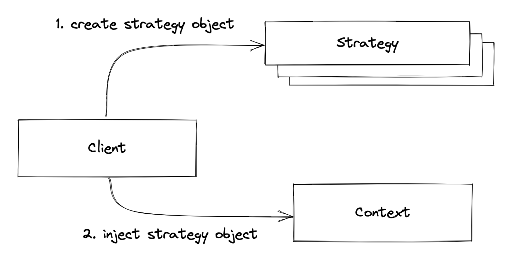

# 06. 스프링이 사랑한 디자인 패턴

날짜: 2021년 10월 30일

프로그램을 작성하다 보면 비슷 비슷한 상황에 직면하게 되는 경우가 많은데, 이러한 상황에서 고민하고 정제된 사실상의 표준 설계패턴이 디자인 패턴이다.

디자인 패턴은 실제 개발 현장에서 비즈니스 요구 사항을 프로그래밍으로 처리하면서 만들어진 다양한 해결책 중에서 많은 사람들이 인정한 베스트 프랙티스를 정리한 것이다.

스프링은 객체 지향의 특성과 설계 원칙을 극한까지 적용한 프레임워크이기 때문에 스프링을 공부하다 보면 자연스럽게 객체 지향 설계의 베스트 프랙티스, 즉 디자인 패턴을 만날 수 있다.

이번 장에서 스프링 프레임워크에서 자주 사용하고 있는 디자인패턴을 알아보자.

# 어댑터 패턴

어댑터패턴이란 **변환기**. 서로 다른 두 인터페이스 사이에 통신이 가능하게 하는 것.

## 등장배경

어댑터 패턴을 적용하기 전 코드를 보자.

```java
class ServiceA {
    void runServiceA() {
        System.out.println("service a");
    }
}

class ServiceB {
    void runServiceB() {
        System.out.println("service b");
    }
}

class ClientWithNoAdapter {
    public static void main(String[] args) {
        ServiceA serviceA = new ServiceA();
        ServiceB serviceB = new ServiceB();

        serviceA.runServiceA();
        serviceB.runServiceB();
    }
}
```

- 각 메서드가 비슷한 일을 하지만 메서드명이 다르다.
- 리팩토링을 해보자.

```java
interface AdapterService {
    void runService();
}

class AdapterServiceA implements AdapterService {
    ServiceA serviceA = new ServiceA();

    @Override
    public void runService() {
        serviceA.runServiceA();
    }
}

class AdapterServiceB implements AdapterService {
    ServiceB serviceB = new ServiceB();

    @Override
    public void runService() {
        serviceB.runServiceB();
    }
}

class ServiceA {
    void runServiceA() {
        System.out.println("service a");
    }
}

class ServiceB {
    void runServiceB() {
        System.out.println("service b");
    }
}

class ClientWithNoAdapter {
    public static void main(String[] args) {
        AdapterService adapterServiceA = new AdapterServiceA();
        AdapterService adapterServiceB = new AdapterServiceB();

        adapterServiceA.runService();
        adapterServiceB.runService();
    }
}
```

- 동일한 메서드명으로 두 객체의 메서드를 호출하여 유지보수성을 높일 수 있다.

> "어댑터 패턴은 호출당하는 쪽의 메서드를 호출하는 쪽의 코드에 대응하도록 중간에 변환기를 통해 호출하는 패턴"

## 예시

JDBC가 어댑터 패턴을 이용해 다양한 데이터베이스 시스템을 단일한 인터페이스로 조작할 수 있다.

어댑터 패턴은 개방 폐쇄 원칙(OCP)를 활용한 설계 패턴

# 프록시 패턴

프록시 패턴의 경우 실제 서비스 객체가 가진 메서드와 같은 이름의 메서드를 사용하는데, 이를 위해서 인터페이스를 사용한다.

## 등장배경

인터페이스를 사용하면서 원래 객체 대신 대리자 객체를 대신 투입해 클라이언트 쪽에서는 실제 서비스 객체를 통해 메서드를 호출하고 반환 받는지, 대리자 객체를 통해 메서드를 호출하고 반환값을 받는지 전혀 모르게 처리할 수 있다.

```java
class Service implements IService {
    @Override
    public String runSomething() {
        return "하이하이";
    }
}

class Proxy implements IService {
    IService service;

    @Override
    public String runSomething() {
        service = new Service();
        return service.runSomething();
    }
}

class ClientWithProxy {
    public static void main(String[] args) {
        IService proxy = new Proxy();
        System.out.println(proxy.runSomething());
        System.out.println(proxy.runSomething());
    }
}
```

- proxy 매번 부를때마다 service는 다른 객체일까?
  - 첫 번째 proxy.service : `Service@785`
  - 두 번째 proxy2.service : `Service@786`

## 특징

프록시 패턴은 실제 서비스 메서드의 반환값에 가감(`+`, `-`)하는 것을 목적으로 하지 않고 제어의 흐름을 변경하거나 다른 로직을 수행하기 위해 사용한다.

- OCP(확장에 열려있다.), DIP(인터페이스를 중간에 둠) 원칙이 보인다.

## 예시

JPA Entity Proxy class

# 데코레이터 패턴

프록시 패턴과 비슷하지만, 데코레이터는 클라이언트가 받는 반환값에 장식을 덧입힌다.

```java
class Service implements IService {
    @Override
    public String runSomething() {
        return "하이하이";
    }
}

class Decorator implements IService {
    IService service;

    @Override
    public String runSomething() {
        service = new Service();
        return "푸하하" + service.runSomething();
    }
}

class ClientWithDecorator {
    public static void main(String[] args) {
        IService decorator = new Decorator();
        System.out.println(decorator.runSomething());
    }
}
```

# 싱글턴 패턴

싱글턴 패턴이란, 인스터를 하나만 만들어 사용하기 위한 패턴.

## 등장 배경

커넥션 풀, 스레드 풀, 디바이스 설정 객체 등과 같은 경우

- 인스터스를 여러 개 만들면 불필요한 자원을 사용하게 됨
- 프로그램이 예상치 못한 결과를 낳을 수 있다.

단일 객체인 경우 결국 공유 객체로 사용되지 않아 다른 참조 변수에 영향을 미치지 않게 한다

- 보통 쓰기 가능한 속성을 갖지 않는 것이 정석.
- 나중에 스프링의 싱글턴 빈이 가져야 할 제약조건이기도 하다.

## 코드

필요한건 3가지다.

1. new 를 실행할 수 없도록 생성자에 `private` 접근 제어자를 지정한다.
2. 유일한 단일 객체를 반환할 수 있는 정적 메서드가 필요하다.
3. 유일한 단일 객체를 참조할 정적 참조 변수가 필요하다.

```java
class Singleton {
	static Singleton singletonObject; // 3. 정적 참조 변수

	private Singleton() { }; // 1. 생성자 private 접근 제어자

	public static Singleton getInstance() {
		if (singletonObject == null) sigletonObject = new Singleton();
		return singletonObject;
	}
}
```

# 탬플릿 메서드 패턴

상위 클래스에 공통 로직을 수행하는 템플릿 메서드와 하위 클래스에 오버라이딩을 강제하는 추상 메서드 또는 선택적으로 오버라이딩할 수 있는 훅(Hook) 메서드를 두즌 패턴.

> "상위 클래스의 견본 메서드에서 하위 클래스가 오버라이딩한 메서드를 호출하는 패턴"

```java
abstract class Animal {
	// template method
	public void playWithOwner() {
		System.out.println("귀염둥이 이리온...");
		play();
		runSomething();
		System.out.println("잘했어");
	}

	// abstract method
	abstract void play();

	// Hook method
	void runSomething() {
		System.out.println("꼬리 살랑살랑");
	}
}

class Dog extends Animal {
  @Override
	void play() { // abstract method overriding
		System.out.println("bark bark!");
	}

  @Override
	void runSomething() { // hook method overriding
		System.out.println("멍멍~ 꼬리 살랑살랑");
	}
}

```

# 팩터리 메서드 패턴

팩터리 메서드 패턴은 하위 클래스에서 팩터리 메서드를 오버라이딩해서 객체를 반환하게 하는 것을 의미.

객체 생성 처리를 서브 클래스로 분리 해 처리하도록 캡슐화하는 패턴

- 즉, 객체의 생성 코드를 별도의 클래스/메서드로 분리함으로써 객체 생성의 변화에 대비하는 데 유용하다.
- 특정 기능의 구현은 개별 클래스를 통해 제공되는 것이 바람직한 설계다.
  - 기능의 변경이나 상황에 따른 기능의 선택은 해당 객체를 생성하는 코드의 변경을 초래한다.
  - 상황에 따라 적절한 객체를 생성하는 코드는 자주 중복될 수 있다.
  - 객체 생성 방식의 변화는 해당되는 모든 코드 부분을 변경해야 하는 문제가 발생한다.
- 스트래티지 패턴, 싱글턴 패턴, 템플릿 메서드 패턴을 사용한다.

# 전략 패턴

세 가지 요소를 기억할 것.

1. 전략 메서드를 가진 **전략(Strategy)** 객체
2. 전략 객체를 사용하는 **컨텍스트**(전략 객체의 사용자/소비자)
3. 전략 객체를 생성해 컨텍스트에 주입하는 **클라이언트**(제3자, 전략 객체의 공급자)



```java
interface Strategy {
	public abstract void runStrategy();
}

// 1. 전략 객체
class StrategyGun implements Strategy {
	@Override
	public void runStrategy() {
		System.out.println("banbang");
	}
}

// 2. 컨텍스트
class Solider {
	void runContext(Strategy strategy) {
		System.out.println("start");
		staregy.runStrategy();
		System.out.println("end");
	}
}

// 3. 클라이언트
class Client {
	public static void main(String[] args) {
		Solider rambo = new Solider();

		Strategy strategy = new StrategyGun();
		rambo.runContext(strategy);
	}
}
```

전략을 다양하게 변경하면서 컨텍스트를 실행할 수 있다.

같은 문제 해결책으로 상속을 이용하는 **템플릿 메서드 패턴**과 객체 주입을 통한 **전략 패턴** 중에서 선택 / 적용 할 수 있다.

> "클라이언트가 전략을 생성해 전략을 실행할 컨텍스트에 주입하는 패턴"

# 탬플릿 콜백 패턴

Spring의 DI에서 사용하는 특별한 형태의 전략 패턴이다.

전략 패턴과 모든 것이 동일하지만, 전략을 익명 내부 클래스로 정의해서 사용한다는 것이 특징.

```java

// 2. 컨텍스트
class Solider {
	void runContext(String weaponSound) {
		System.out.println("start");
		executeWeapon(weaponSound).renStrategy();
		System.out.println("end");
	}

	private Strategy executeWeapon(final String weaponSound) {
		return new Strategy() { // 이러면 매번 실행할 때마다 객체를 생성하지 않는가..?
			@Override
			public void runStrategy() {
				System.out.println(weaponSound);
			}
		}
	}
}
```

> 전략을 익명 내부 클래스로 구현한 전략 패턴

# 질문 사항

### Q. dtoToEntity와 같은 Mapping / converter는 AdapterPattern 을 적용한것이 맞는가?

A. 어뎁터패턴은 기능과 기능 연결에서 서로 연결에 맞지 않아 그 기능을 사용할 수 없을때 사용하는 것이다. 그래서 converter는 단순 Mapper 클래스.
[참고 링크](https://stackoverflow.com/questions/11588557/is-an-adapter-and-converter-the-same-thing)


### Q. 모든

A. 모든 제어권을 Spring Framework를 가지고 있는데 Application Context가 IoC을 주관하는 주체. Application Context모든 빈을 가지고 있어야함. 그런데 Bean이 싱글톤이여야지 멀티 스레드 환경에서 안전하고, 여러 Repository를 사용할때 다른 Bean이라면 관리도 안되고, RuntimeException이 난다. ApplicationContext가 관리해야하기때문에 SingleTon으로 관리한다.


### Q. 싱글톤 패턴은 Thread-safe하지 않는데.,,?

A. 스프링은 reflection으로 객체를 생성하고, 예제는 직접 new로 생성하는 것. spring은 new로 생성하는 것이 아닌 reflection으로 생성. Reflection Proxy AOP. 
[참고 링크](https://medium.com/@joongwon/multi-thread-%ED%99%98%EA%B2%BD%EC%97%90%EC%84%9C%EC%9D%98-%EC%98%AC%EB%B0%94%EB%A5%B8-singleton-578d9511fd42)