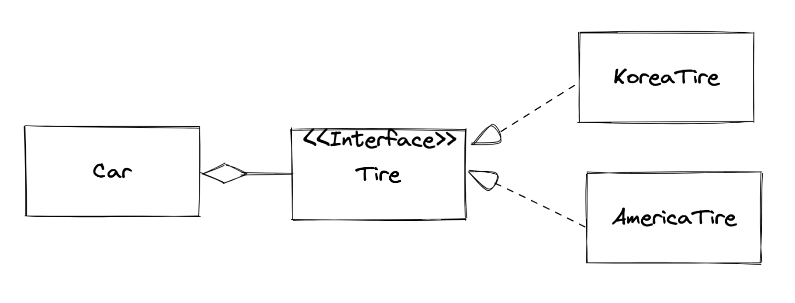

# 07. 스프링 삼각형과 설정 정보

날짜: 2021년 11월 7일

POJO(Plain Old Java Object)를 기반으로 스프링 삼각형이라응 이름을 가진 IoC/DI, AOP, PSA 라고 하는 스프링의 3대 프로그래밍 모델에 대해 배워보자.

> **What is POJO?**
>
> - 특정 규약(contract)에 종속되지 않는다. (Java 언어와 꼭 필요한 API 외에 종속되지 않는다.)
> - 특정 환경에 종속되지 않는다.
> - 객체지향원리에 충실해야 한다.
>
> **POJO를 사용하는 이유**
>
> - 코드의 간결함 (비즈니스 로직과 특정 환경/low 레벨 종속적인 코드를 분리하므로 단순하다.)
> - 자동화 테스트에 유리 (환경 종속적인 코드는 자동화 테스트가 어렵지만, POJO는 테스트가 매우 유연하다.
> - 객체지향적 설계의 자유로운 사용
>
> 출처: [https://limmmee.tistory.com/8](https://limmmee.tistory.com/8) [심플하게 개발]

# 01. IoC/DI - 제어의 역전 / 의존성 주입

## 프로그래밍에서 의존성이란?

책에서 의존성을 `new`라고 표현하였다. 의존하는 객체(전체)가 의존되는 객체(부분)에 의존함으로써 _"프로그래밍에서 의존 관계는 new로 표현된다!"_ 라고 하였다.



Car는 Tire에 의존한다.

```java
public class Driver {
	public static void main(String[] args) {
		Car martiz = new Car();
	}
}

// Car : 자동차 생성자에서 new Tire()를 하였다.
public class Car {
  private Tire tire;

	public Car() {
		tire = new KoreaTire(); // <- 의존 관계가 일어나고 있는 부분
	}
}

public class KoreaTire implements Tire {
  public String getBran() { return "한국 타이어"; }
}
```

## 스프링 없이 의존성 주입하기1 - 생성자를 통한 의존성 주입

### 주입이란?

주입이란 말은 외부에서 뜻을 내포하고 있는 단어이다.

자동차 내부에서 타이어를 생산하는 것이 아니라, 외부에서 생산된 타이어를 자동차에 장착하는 작업이 주입이다.


외부에서 생산된 tire 객체를 Car 생성자의 인자로 주입하는 형태로 구현해 본다.

```java
public class Car {
	public Car(Tire tire) {
		this.tire = tire;
	}
}
```

이러한 구현법의 장점

- 기존 코드는 Car가 구체적으로 어떤 Tire를 생산할지를 결정하였음 → 유연성이 떨어짐.
- Tire 인터페이스를 사용함으로써 확장성이 좋아지는데, 새로운 타이어 브랜드가 생겨도 각 타이어 브랜들이 Tire 인터페이스를 구현한다면 Car 코드 변경할 필요 없이 사용할 수 있기 때문.
- 실제 제품화하게 되면 더 많은 코드를 재배포할 필요가 없도록 구성해야만 코드 재컴파일과 재배포에 대한 부담을 덜 수 있다.

## 스프링 없이 의존성 주입하기2 - 속성을 통한 의존성 주입

생성자 주입은 한번 타이어를 장착하면 더 이상 타이어를 교체 장착할 방법이 없다는 문제가 발생.

자바에서 원할 때 Tire를 바꾸는 방법을 구현하려면 생성자가 아닌 속성을 통한 의존성 주입이 필요하다.

```java
public class Car {
	Tire tire;
	public Tire getTire() { return tire; }
	public Tire setTire(Tire tire) { this.tire = tire; }
}
```

tire속성에 대한 접근자 및 설정자 메서드를 통해 의존성을 바꾸어 끼울 수 있다.

## 스프링을 통한 의존성 주입 - XML 파일 사용

스프링을 통한 의존성 주입은 생성자를 통한 의존성 주입과 속성을 통한 의존성 주입 모두 지원하는데, 여기서는 속성을 통한 의존성 주입만 살펴본다.

```java
ApplicationContext context = new ClassPathXmlApplicationContext("export002.xml", Driver.class);

Tire tire = (Tire) context.getBean("tire");

Car car = (Car) context.getBean("car");
car.setTire(tire);
```

```xml
<!-- 빈 정보 등록하기 위한 XML 파일 -->
<?xml version="1.0" encoding="UTF-8"?>
<beans ~~>
	<bean id="tire" class="export002.KoreaTire"></bean>
	<bean id="americaTire" class="export002.AmericaTire"></bean>
```

스프링 프레임워크는 Bean들을 스프링 빈 설정 파일로 모두 관리하여 의존성을 여기서부터 가져와서 교체할 수 있다.

스프링을 도입해서 얻는 이득은 무엇일까?

- 의존성들을 변경할 때 그 무엇도 재 컴파일 / 재 배포하지 않아도 XML 파일만 수정하면 프로그램의 실행 결과를 바꿀 수 있다.

## 스프링을 통한 의존성 주입 - 스프링 설정 파일(XML)에서 속성 주입

```xml
<!-- 빈 정보 등록하기 위한 XML 파일 -->

<bean id="americaTire" class="export003.AmericaTire"></bean>
<bean id="koreaTire" class="export003.KoreaTire"></bean>

<bean id="car" class="export003.Car">
	<property name="tire" ref="koreaTire"></property>
</bean>
```

`car.setTire(tire)` 부분을 XML 파일의 `property` 태그를 이용해 대체 하였음.

특징으로는

- 자바 코드와 XML 설정을 익혀야 하는 부담은 있지만,
- 더욱 현실적인 내용을 반영하기에 이해하기 쉽고 유지보수하기 편한 방식으로 변했음.

## 스프링을 통한 의존성 주입 - `@Autowired`를 통한 속성 주입

반드시 설정자 메서드를 통해 tire 값을 주입해야하는 것일까?

`import`문 하나와 `@Autowired` 애노테이션을 이용하면 설정마 메서드를 이용하지 않고도 스프링 프레임워크가 설정 파일을 통해 설정자 메서드 대신 속성을 주입해 준다.

```xml
<beans>
	<context:annotation-config />
	<bean id="car" class="export004.Car"></bean>
</beans>
```

```java
@Autowired
Car car;
```

`@Autowired` 은 스프링 설정 파일을 보고 자동으로 속성의 설정자 메서드에 해당하는 역할을 해주겠다는 의미이다. 그래서 XML에 `<property>` 태그가 사라지고 `@Autowired`가 해당하는 property를 자동으로 엮어줄 수 있다.

참고로 `@Autowired` 는 type 기준 매칭에 있어서 같은 타입을 구현한 클래스가 여러 개 있다면 그때 bean 태그의 id로 구분해서 매칭하게 된다. (id와 type중 type의 우선순위가 높다)

## 스프링을 통한 의존성 주입 - `@Resource` 를 통한 속성 주입

[제목 없음](https://www.notion.so/f0e8065636cf47718322c82155ad4870)

> JSR-250, JSR-330

## 마무리

변수에 값을 할당하는 모든 곳에 의존 관계가 생긴다. 의존 대상이 내부에 있을 수도 있고, 외부에 있을 수도 있다. DI는 외부에 있는 의존 대상을 주입하는 것을 말한다. 의존 대상을 구현하고 배치할 때 SOLID와 응집도는 높이고 결합도는 낮추라는 기본 원칙에 충실해야 한다. 그래야지 프로젝트의 구현과 유지보수가 수월해진다.

---

# 02. AOP - Aspect? 관점? 핵심 관심사? 횡단 관심사?

_"스프링 DI는 의존성에 대한 주입이라면 스프링 AOP는 로직 주입이라고 할 수 있다."_

횡단 관심사

- 데이터베이스 연동 프로그램을 작성한적이 있다면, DB 커넥션 준비, Statement 객체 준비, try catch 등 반복되는 구문이 등장할 것이다.
- 이러한 공통적으로 나타나는 코드를 횡단 관심사라고하고, 핵심 로직은 핵심 관심사라고 한다.
  - 코드 = 핵심 관심사 + 횡단 관심사


AOP는 로직의 주입이라고 했는데, 로직을 주입한다면 어디에 주입할 수 있을까?


- Around
- Before
- After
- AfterReturning
- AfterThrowing

## 따라해보기

1. 스프링 설정 파일에서 AOP를 설정한다.

   ```xml
   <beans>
   	<aop:aspectj-autoproxy />
   	<bean id="myAspect" class="aop002.MyAspect"/>
   	<bean id="boy" class="aop002.Boy"/>

   </beans>
   ```

2. MyAspect라는 AOP 로직을 작성한다.

   ```java
   @Aspect
   public class MyAspect {
   	@Before("execution(public void aop002.Boy.runSomething ())")
     public void before(JoinPoint joinPoint) {
   		System.out.println("시작하기 전입니당")
   	}
   }
   ```

   - `@Aspect` : 이 클래스를 이제 AOP에서 사용하겠다는 읨.
   - `@Before` : 대상 메서드 실행 전에 이 메서드를 실행하겠다는 의미

## 설명

AOP를 적용하게 되면

- 파일을 분할해서 개발하는 수고를 해야 하지만, 추가 개발과 유지보수 관점에서 보면 무척 편한 코드가 된다.
- 단일 책임 원칙을 자연스럽게 적용하게 된다.
- 개발자들은 횡단 관심사를 신경 쓰지 않고 핵심 관심사만 코딩하면 된다.

AOP 요건을 충족하기 위해서는

- 스프링 AOP가 인터페이스 기반이기 때문에, 적용될 코드는 인터페이스를 상속받아야한다.

AOP 작동 방식

- AOP는 프록시 패턴을 이용해 횡단 관심사를 핵심 관신사에 주입하는 것.
- 호출하는 쪽에서 메서드를 호출하면
  - 프록시가 그 요청을 받아 진짜 객체에게 요청을 전달하는데
  - 마냥 전달하는것이 아닌, 프록시에서 주고받는 내용을 감시하거나 조작할 수 있다.
- 스프링 AOP는 스프링프레임워크에서 관리하기 때문에 호출하는쪽과 호출되는 쪽 그 누구도 프록시가 존재하는지조차 모른다.

그래서 AOP의 핵심은,

- 스프링 AOP는 인터페이스 기반이다.
- 스프링 AOP는 프록시 기반이다.
- 스프링 AOP는 런타임 기반이다.

## 용어

```java
@Aspect
public class MyAspect {
	@Before("execution(* runSomething() )")
	public void before(JoinPoint joinPoint) {
		System.out.println("시작전");
	}
}
```

### Pointcut - Aspect 적용 위치 지정자

- `* runSomething()` 부분이 바로 Pointcut.
- 횡단 관심사를 적용할 타깃 메서드를 선택하는 지시자(메서드 선택 필터)
- 왜 Aspect 적용 위치 지정자일까?
  - AspectJ처럼 스프링 AOP 이전부터 있었고 지금도 유용하게 사용되는 다른 AOP 프레임워크에서는 메서드뿐만 아니라 속성 등에도 Aspect를 적용할 수 있기에
  - 그것들 까지 고려한다면 Aspect 적용 위치 지정자가 맞는 표현이다.
- 타깃 메서드 지정자의 정규식
  - `[접근제한자패턴] 리턴타입패턴 [패키지&클래스패턴.]메서드이름패턴(파라미터패턴) [throws 예외패턴]`

### JoinPoint - 연결점? 연결 가능한 지점!

- Aspect 적용이 가능한 지점, "Aspect 적용이 가능한 모든 지점을 말한다."
- 스프링 AOP에서 JoinPoint란 스프링 프레임워크가 관리하는 빈의 모든 메서드에 해당한다.
- JoinPoint 파라미터를 이용하면
  - 실행 시점에 실제 호출된 메서드가 무엇인지
  - 실제 호출된 메서드를 소유한 객체가 무엇인지
  - 호출된 메서드의 파라미터는 무엇인지 등의 정보를 확인할 수 있다.

### Advice - 조언? 언제, 무엇을!

- Advice는 pointcut에 적용할 로직, 즉 메서드를 의미. 여기에 더해 **언제**라는 개념까지 포함하고 있다.
  - 언제, 무엇을 적용할지 정의한 메서드
- 지정된 PointCut이 시작되기 전에 (MyAspect에 정의된) `before()` 메서드를 실행하라고 되어있다.

### Aspect - 관점? 측면? Advisor의 집합체!

- Aspect = Advice들 + PointCut들

### Advisor - 조언자? 어디서, 언제, 무엇을!

- Advisor = 한 개의 Advice + 한 개의 PointCut
- Advisor는 스프링 AOP에서만 사용하는 용어. 이제는 쓰지말라고 권고하는 기능.
- 다수의 Advice와 다수의 PointCut을 다양하게 조합해서 사용할 수 있는 방법(Aspect)가 나옸기 때문에 하나의 Advbice와 하나의 PointCut만을 결합하는 Advisor를 사용할 필요가 없어졌기 때문.

## POJO와 XML 기반 AOP

1. MyAspect

   ```java
   // 어노테이션 기반은 스프링 프레임워크에 종속되어있다. 이것을 수정해보자.
   public class MyAspect {
     public void before(JointPoint jointPoint) {
   		sout("하기전");
   	}
   }
   ```

2. XML로 AOP 관리

   ```xml
   <aop:config>
   	<aop:aspect ref="myAspect">
   		<aop:before method="before" pointcut="execution(* runSomething() )" />
   	</aop:aspect>
   </aop:config>
   ```

이렇게 하여 MyAspect 파일은 스프링 프레임워크에 의존하지 않는 POJO가 되었다!

### AOP 중복 부분 내용 리팩토링

1. Annotation 기반

   ```java
   @Component
   @Aspect
   public class MyAspect {
     @Pointcut("execution(* runSomething())" )
     private void iampc() { /* 여기 무엇을 작성해도 의미가 없다. */ }

   	@Before("iampc()")
     public void before(JointPoint jointPoint) {
   		sout("하기전");
   	}
   	@Aefore("iampc()")
     public void aefore(JointPoint jointPoint) {
   		sout("한 후");
   	}
   }
   ```

2. XML 기반

   ```xml
   <aop:config>
     <aop:pointcut expression="execution(* runSomething())" id="iampc"/>
   	<aop:aspect ref="myAspect">
   		<aop:before method="before" pointcut-ref="iampc" />
   		<aop:after method="after" pointcut-ref="iampc" />
   	</aop:aspect>
   </aop:config>
   ```

---

# 03. PSA - 일관성 있는 서비스 추상화

PSA(Portable Service Abstraction),즉 일관성 있는 서비스 추상화다.

서비스 추상화의 예로

- JDBC
- OXM
- Castor
- JAXB
- XMLBeans
- ORM
- Cache
- Transaction

공통된 방식으로 코드를 작성할 수 있는데, 이는 어댑터 패턴을 활용했기 때문임. 스프링은 제각각인 API를 위한 어댑터를 제공함으로써 실제로 어떤 OXM 기술을 쓰든 일관된 방식으로 코드를 작성할 수 있게 지원한다.

**같은 일을 하는 다수의 기술을 공통의 인터페이스로 제어할 수 있게 한 것을 서비스 추상화 라고한다.**

이처럼 서비스 추상화를 해주면서 그것도 일관성 있는 방식을 제곤한다고 해서 이를 PSA라고 한다.

---

# 참고

- 스프링 프레임워크 1 - POJO에 대하여 - [https://limmmee.tistory.com/8](https://limmmee.tistory.com/8)
- 스프링의 기본 철학, 스프링 삼각형 - [https://blog.gthd.app/m/8](https://blog.gthd.app/m/8)
